# Word Monster
---
*Note: this website was created for educational purposes as a student of Code Institute, and the game described below is a fictional one.*

[View the live website here](https://fiona-t.github.io/word-monster/)

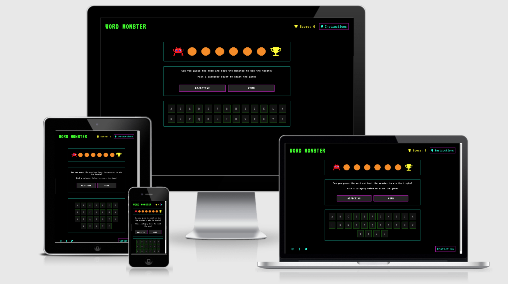

## Table of Contents
- [Purpose](#purpose)
- [User Experience (UX)](#user-experience-ux)
  * [User stories](#user-stories)
  * [Design](#design)
    + [Colour scheme](#colour-scheme)
    + [Typography](#typography)
  * [Wireframes](#wireframes)
- [Features](#features)
  * [Existing Features](#existing-features)
  * [Future Features](#future-features)
- [Content Requirements](#content-requirements)
- [Technology](#technology)
  * [Languages](#languages)
  * [Frameworks, Libraries, Programmes and Tools](#frameworks-libraries-programmes-and-tools)
- [Testing](#testing)
  * [Code Validation](#code-validation)
  * [Test Cases - user stories](#test-cases---user-stories)
  * [Features Testing](#features-testing)
  * [Fixed Bugs](#fixed-bugs)
  * [Other Testing (links etc.)](#other-testing-links-etc)
  * [Supported Screens and Browsers](#supported-screens-and-browsers)
- [Deployment](#deployment)
  * [Gitpod - during development](#gitpod---during-development)
  * [GitHub Pages - Deployment](#github-pages---deployment)
  * [Forking the GitHub Repository](#forking-the-github-repository)
  * [Cloning the GitHub Repository](#cloning-the-github-repository)
- [Credits](#credits)
  * [Code](#code)
  * [Content](#content)
  * [Media](#media)
- [Acknowledgements](#acknowledgements)

## Purpose
---
Word Monster is a game based on the classic 'hangman' game, where the user has to figure out a word by guessing one letter at a time. The game is over when the user has guessed incorrectly 7 times, or when they have revealed the word by guessing all the correct letters. For this version, instead of drawing part of the hangman for each wrong guess (as is the case for the classic version of the game), there is a 'monster' character with obstacles between it and the trophy. Each wrong guess erases an obstacle and the monster claims the trophy on the seventh wrong guess. The reason for using this character instead of the classic hangman is to make it a bit more friendly and light-hearted, bearing in mind the target audience. 

The game is aimed at school-age children as a fun way of helping them to learn words and how they are spelled. It is also designed to appeal to adults in a nostalgic way, since many played hangman as children and the style of the game is reminiscent of old video games.

### User’s goals:
- the game's users want to practice their spelling
- they want to improve their vocabulary
- they want to exercise their brain in a fun way
- they want a fun, nostalgic game to divert attention for a few minutes of their day

### Site owner’s goal:
- the goal of the website is to provide a game for use by school-age children to help with learning the correct spelling of words, and to improve their vocabulary by exposing them to different words in the game. 
- And to provide a game for adults who want to brush up on their spelling and/or vocabulary, or just want to exercise their brain a little bit, or play the game for a few minutes of distraction from daily life.

## User Experience (UX)
---
### User stories
Note: there is no login or registered users on this site so each user story is from the point of view of a visiting user.
1. As a visiting user, I want to find out how to play the game so that I can start to play
2. As a visiting user, I want to be able to select the category from which the random word will be chosen so that I know which type of word it is to help guide my guesses
3. As a visiting user, I want to know how many letters are in the word to be guessed so that I can make a decision on which letters might be in the word
4. As a visiting user, I want to know which letters I have already guessed when playing the game so that I can decide my next guess
5. As a visiting user, I want to know if my guess was correct or not so that I can plan my next guess
6. As a visiting user, I want to see the correctly guessed letters displayed in the correct place in the word, so that I can plan my next guess
7. As a visiting user, I want to know how many chances I have left to guess incorrectly so that I can try to avoid losing the game
8. As a visiting user, I want to be able to get a hint to help me guess the word
9. As a visiting user, I want to know what the word was, if I lose the game, so that I can learn the word or see how it is spelled
10. As a visiting user, I want to know the meaning of the word at the end of the game, regardless of whether I won or lost, so that I can add the word to my vocabulary 
11. As a visiting user, I want to know how many games I have won during this session of playing.
12. As a visiting user, I want to be able to contact the site owners if I come across any issues, have questions on the game or suggestions for improvement.

### Design
The design of the Word Monster site and game takes inspiration from 'old-school' arcade video games like Pac-Man and Space Invaders. The simplicity of the 'hangman' style game is reflected in using the same style of simple graphics from these 80s video games. It also brings a sense of nostalgia for older visitors to the site, who may remember both these old video games, as well as playing the paper and pencil version of 'hangman' when they were children. For children, the simple graphics and bright colours should appeal and stand out in a world of realistic graphics and animations! The design of the game will reflect this through the use of colour, typography and graphics. 
The monster graphic is based on and reminiscent of the characters from Space Invaders and Pac-Man.

  - #### Colour scheme
    In keeping with the theme of nostalgic video games, the colour scheme draws on colours similar to those used in these games. The game users a solid black background, white text and bright primary colours for the graphics. These colours against the black background also give good contrast for accessibility.
    >
    Colour palette:

    
    - Green `#32ff00` is used for the logo, for outlining the keyboard buttons, as the 'correct guess' colour of pressed keys, and for outlining valid inputs into the Contact Form.
    - Turquoise blue `#00ffde` is used as the outline around each section, for links, and for the text inside the Contact Form inputs. 
    - Pink `#ff00ff` is used for the 'labels' and buttons within the 'word-area' section of the game, and for links on hover throughout the website.
    - Red `#fb1307` is used for the 'monster' graphic, and as the 'incorrect guess' colour for the pressed keys.
    - Orange `#f78c0e` is used for the 'obstacles' between the monster and the trophy, as well as the outlines for the Contact Form inputs, until they change colour when valid data is entered.
    - Yellow `#ffff00` is used for the trophy and the Score.
    - Black `#000` is used for the background and White `#fff` for body text.

  - #### Typography
    - **VT323** is used for the logo, headings, game buttons and the 'game over' text. This font is based on square pixels and so fits well with the style of this game. However it would not be very readable for large blocks of text so it is used sparingly here.
    - **IBM Plex Mono** is used for the body text. As a monospaced font with a squared off appearance it is reminiscent of old computer typefaces so fits with the theme, while also being readable.

### Wireframes
  - Desktop/tablet wireframes:
    - [Homepage](docs/wireframes/home-desktop-tablet.png)
    - [Instructions](docs/wireframes/instructions-desktop-tablet.png)
    - [Game in progress](docs/wireframes/game-in-play-desktop.png)
     - [Game over - user won game](docs/wireframes/game-over-won-desktop.png)
    - [Game over - user lost game](docs/wireframes/game-over-lost-desktop.png)
    - [Contact Form](docs/wireframes/contact-form-desktop.png)

  - Mobile wireframes:
    - [Homepage - game not started](docs/wireframes/home-mobile.png)
    - [Instructions](docs/wireframes/instructions-mobile.png)
    - [Game in progress](docs/wireframes/game-in-play-mobile.png)
    - [Game over - user won game](docs/wireframes/game-over-won-mobile.png)
    - [Game over - user lost game](docs/wireframes/game-over-lost-mobile.png)
    - [Contact Form](docs/wireframes/contact-form-mobile.png)
  - [View all wireframes in pdf here.](docs/wireframes/wireframes-all.pdf)
  - Changes from Original Wireframe Designs:
    - In the Header, the Score and Instructions are represented by icons only at smaller screen sizes. 
    - Previous versions of wireframes showed a 2 column layout for the game at larger screen sizes. This layout was developed accordingly, however folowing feedback from my mentor and others, it was decided to keep the one column layout for the game at all screen sizes
    - Originally the website was one page and did not contain a Contact Form. This was added as a feature later in the project and Wireframes were updated. At this point Session Storage was introduced as a feature also, so that Score could be retained when moving between pages.

## Features
---
### Existing Features
- #### Header
  - Top of the page, contains game name on the left, Score and Instructions on the right.
  - Fixed to the top of the page so that score is always visible
  - Instructions: when clicked displays the instructions on how to play the game, X in top right corner to close and return to game page
  - Score: displays a number indicating to the user how many games they have won during this session of playing. Display only, not clickable.
  - Since there is more than one page, session storage to be used to retain the user's score when moving between the Game and the Contact Form/Form Success pages
- #### Game area:
  - Consists of three sections: Monster/guesses section; Word section; Keyboard section. The features of each vary depending on which stage the game is in: not-started, in-play, or over.
  - the full game area should always be visible on the screen without having to scroll down, where possible. This is especially important for mobile screens viewing, for supported devices.
- #### Game area - 'Monster/guesses remaining' section:
  - At the 'not-started' stage of the game there is a 'monster' character and 6 obstacles between it and the trophy icon
  - During the 'in-play' stage, wrong guesses are represented visually by this monster character getting closer to the trophy icon
  - For each wrong guess, one obstacle disappears and the monster moves into its place, thereby getting closer to the trophy
  - On the seventh wrong guess, the trophy disappears, meaning the game has been lost. The game is now in the 'over' state and a message is displayed: "Game Over. You Lost"
  - If the user guessed the letters correctly before the monster gets to the trophy, the game also enters the 'over' state and a message is displayed: "Game Over! You Won the Trophy!". 
- #### Game area - 'Word' section:
  - This subsection contains a text box and a button area, again these change depending on the stage of the game
  - At the 'not-started' stage of the game, the text box instructs user to choose a category from the two buttons below it - Adjective or Verb. These are the word categories from which the random word will be chosen.
  - Once one of these buttons is pressed/clicked on, the game starts and is in the 'in-play' stage
  - The text box now displays the chosen word category, and underneath this it shows a number of dashes representing the letters in the word to be guessed. 
  - When letters are guessed correctly, these are shown in the relevant place in the word, above the dash
  - A Hint button is shown underneath the word to be guessed
  - When the Hint button is clicked, it displays a hint to help the user determine what the word might be. The hint then remains displayed on the page until the game is over
  - When the game enters the 'over' stage, the text box shows a message confirming what the word was and its meaning. 
  - The button is now a "Play Again" button, which re-sets the game back to the 'not-started' stage so that the user can select a category to play a new game
- #### Game area - 'Keyboard' section:
  - This section is below the word to be guessed and contains a keyboard of letters from A to Z
  - The user guesses a letter by pressing/clicking on one of the letters
  - Once a letter has been guessed it cannot be pressed/clicked on again, and it visually displays a different color to show if it was correct or incorrect
  - The keyboard letters are always displayed but are only active when the game is in the 'in-play' stage 
  - *Note:* The use of this keyboard on screen instead of using the keyboard of the device serves two purposes: allowing the keyboard to be enabled or disabled at different stages of the game, and visually displaying the already guessed letters during the game.
- #### Footer:
  - contains the social media links: Facebook, Instagram and Twitter, represented by icons. 
  - on the home page, contains the Contact Us link to the Contact Form page. This link is not shown while the game is in the in-play stage, because leaving the main page would lose progress in the game. 
  - on the Contact Form page and Form Success page, footer contains Back to Game link in place of the Contact Us link
- #### Contact Form:
  - contains the following inputs (all are mandatory) and validations:
    - First name: text
    - Surname: text
    - Email address: must be valid format for email address
    - Message: text
  - the border on inputs changes colour to indicate when a valid input is received
  - button called Send Message to submit the form
  - Success page is displayed after submitting, showing the first name that was input into the form First Name field 

### Future Features
- Extend the range of available word categories to choose from 
- An option to choose the level of difficulty before selecting a category so that harder words are included as the difficulty level increases
- Possibly retrieve the random words from an external resource so that there is a greater selection of words. Not in scope currently due to level of experience of the developer.
- The option for a user to register with a username and have a user profile where they can see their score among other things
- The option to have a Scoreboard showing different user's scores in particular categories/difficulty levels
- The option for a user to be awarded with a 'badge' on successful completion of a certain number of games in a particular difficulty level and particular category. The badge would be added to their profile.
- Add a timer to the game so that it has to be completed in a certain time. Higher scores could be awarded for winning the game in a shorter amount of time

## Content Requirements
---
- Graphic representing the guesses available:
  - monster character
  - icon representing the guesses
  - trophy icon

- Verb and Adjective listings:
  - a list of words appropriate for the target audience, at least 20 of each type are required in order to have enough words for a player to play several rounds of the game
  - the lists will be held in a script file within the project, rather than retrieved from an external API, since the developer does not have expertise on APIs at this stage
  - Each word needs an associated hint stored with it in the list
  - Each word needs its meaning stored with it in the list
  - in order to be appropriate to the target market, the words are sourced from a combination of the following:
    - [Dolch Words List](https://en.wikipedia.org/wiki/Dolch_word_list), also known as 'Sight Words' which is a list of commonly occurring words from children's books. This covers 80% of words in a typical children's books and 50% to 75% of words in ordinary reading material, excluding proper names.
    - Fry Words List, which is a more modern list of 1,000 common words. These account for about 90% of the words in a typical book, newspaper or website.
    - Word listings commonly used to teach spelling and reading to children in school.

    Sourcing the words from these lists ensures the words are and relevant for the target market of school-age children, as these are words they are learning or have learnt in school, therefore the game can reinforce or help this learning. These words will also be relevant for the older target market of adults since they are drawn from a list of common words. Further details on the sourcing of words for the project is included in the [Credits section](#content) of this document.

## Technology
---
### Languages
 - HTML
 - CSS
 - JavaScript

### Frameworks, Libraries, Programmes and Tools
 - [Balsamiq](https://balsamiq.com/) to design the wireframes
 - The fonts used in the project are imported from [Google Fonts](https://fonts.google.com/)
 - [Eye Dropper](https://eyedropper.org/) extension for Chrome to pick and generate colours for the project
- [Coolors](https://coolors.co/) to generate a colour palette/see how colours worked beside each other
- [Webaim Contrast Checker](https://webaim.org/resources/contrastchecker/) to check the contrast for the colour choices 
- [Adobe Illustrator](https://www.adobe.com/ie/products/illustrator.html) to create the 'monster', trophy and 'obstacle' graphics
- [Font Awesome](https://fontawesome.com/) for the icons used throughout
- Git for version control, using the [Gitpod](https://www.gitpod.io/) terminal to commit to Git and push to GitHub
- [GitHub](https://github.com/) to store the project code and host the live project
- [Chrome Dev Tools](https://developer.chrome.com/docs/devtools/) during development and testing to fix issues with the code and check for responsiveness/different device sizes
- [W3C HTML validator](https://validator.w3.org/) to validate the HTML code
- [W3C CSS Validator](https://jigsaw.w3.org/css-validator/) to validate the CSS code
- [JSHint](https://jshint.com/) to check the quality of and check for errors in the JavaScript code
- [Am I Responsive](http://ami.responsivedesign.is/) to generate the mockup image showing the project on different devices
- [RealFaviconGenerator](https://realfavicongenerator.net/) to convert the PNG graphic into ICO for the favicon

## Testing
### Code Validation
The [W3C Markup Validation Service](https://validator.w3.org/) was used to validate the HTML on every page of the project. There was an error in relation to using `aria-label="hidden"` instead of `aria-hidden="true"`, this was as a result of human error and was rectified. After fixing this error the code validates with no issue.
>
The [W3C CSS Validation Service](https://jigsaw.w3.org/css-validator/) was used to validate the CSS file used for the project. There were no errors found.
>
[JSHint](https://jshint.com/) was used to check the quality of the JavaScript code and check for errors. Apart from `Missing semicolon` errors which were rectified, there was one error:
> 	`Expected an assignment or function call and instead saw an expression` 

The code causing the error was in `script.js` in `function checkLetter()`:
>`isWrongGuess ? handleIncorrectGuess(keyPressed) : handleCorrectGuess(keyPressed);`

This was amended to the `if/else statement` shown below and there is no longer any error.
>`if (wordToGuess.indexOf(keyPressed.innerHTML) === -1) {
        handleIncorrectGuess(keyPressed);
    } else {
        handleCorrectGuess(keyPressed);
    }`

### Test Cases - user stories
This section covers testing the user stories from the [User Experience (UX)](#user-experience-ux) section. All users are visiting users since there is no user registration/login to the website.

1. **Expectation:** *As a visiting user, I want to find out how to play the game so that I can start to play*
>**Result:** Pass
- The header on all pages shows an Instructions button in the top right (lightbulb icon on smaller screens), on clicking this the user is shown a screen entitled Instructions, and the steps to play the game. 
- If the user already knows how to play, the home page shows two buttons "Adjective" and "Verb" above which states "Pick a category below to start the game". 
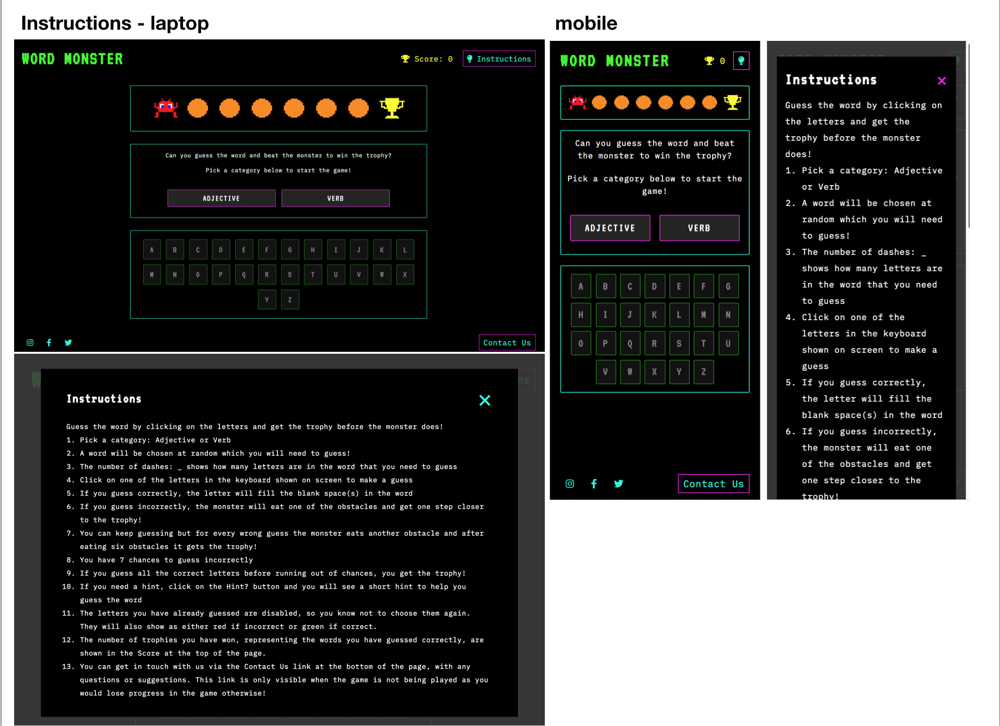
2. **Expectation:** *As a visiting user, I want to be able to select the category from which the random word will be chosen so that I know which type of word it is to help guide my guesses*
>**Result:** Pass
- The home page shows two buttons "Adjective" and "Verb" above which states "Pick a category below to start the game". 
- Throughout the game the user has a reminder of which category they chose, since this is displayed above the word they have to guess.

3. **Expectation:** *As a visiting user, I want to know how many letters are in the word to be guessed so that I can make a decision on which letters might be in the word*
>**Result:** Pass
- As shown in the previous user story, the number of letters in the word are shown on screen after the category is chosen. 
- The letters are represented by dashes _ separated from each other by a space.
- In the example shown above, there are 5 letters in the word
4. **Expectation:** *As a visiting user, I want to know which letters I have already guessed when playing the game so that I can decide my next guess*
>**Result:** Pass
- Throughout the game, letters in the keyboard that have been guessed already are visually different from the remaining letters:
  - the button has reduced opacity, 
  - the letter inside the button is coloured differently (green if correct, red if incorrect) and 
  - the button is disabled so cannot be clicked again. 
- See screenprint below which covers user stories 4, 5, 6 and 7.
5. **Expectation:** *As a visiting user, I want to know if my guess was correct or not so that I can plan my next guess*
- During the game, after the user clicks on a letter from the onscreen keyboard to make a guess, the resulting changes on screen differ depending on whether the guess was correct or not, thus indicating to the user if they were correct or not. 
- If the guess was correct:
  - the letter is displayed in the appropriate place in the word
  - the letter in the keyboard is coloured green
  - the 'monster graphic' does not move
- If the guess was incorrect:
  - the letter in the keyboard is coloured red
  - one 'obstacle' graphic disappears 
  - and the 'monster' graphic jumps one place closer to the trophy.
- This is also explained in the Instructions for the user.
- See screenprint below which covers user stories 4, 5, 6 and 7.
6. **Expectation:** *As a visiting user, I want to see the correctly guessed letters displayed in the correct place in the word, so that I can plan my next guess*
>**Result:** Pass
- Throughout the game, any letters that have been guessed correctly are displayed in the appropriate place in the word
- See screenprint below which covers user stories 4, 5, 6 and 7.
7. **Expectation:** *As a visiting user, I want to know how many chances I have left to guess incorrectly so that I can try to avoid losing the game*
>**Result:** Pass
- Throughout the game, the monster, obstacle and trophy graphics are shown at the top of the page
- The obstacles between the monster and trophy, plus the trophy itself, represent the chances remaining for wrong guesses (this is also explained in the Instructions)
- Each time there is a wrong guess, one of the obstacles (circles) disappears and the monster gets closer to the trophy
- The user can see how many obstacles are remaining at all times during the game 
- In the example below, there are two obstacles and the trophy remaining, so three wrong guesses remaining. This is reinforced by the fact that there are four red letters on the keyboard, so four wrong guesses already 
- See screenprint below which covers user stories 4, 5, 6 and 7.
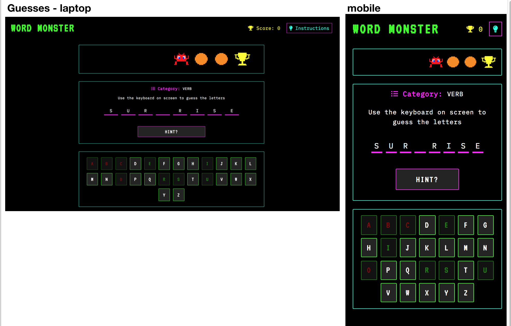
8. **Expectation:** *As a visiting user, I want to be able to get a hint to help me guess the word*
>**Result:** Pass
- Throughout the game, the Hint button is displayed in the middle of the screen under the blank letter spaces representing the word to be guessed (shown in the previous screenprint).
- When the user clicks on the Hint button, a hint for that word is shown in place of the Hint button
- The Hint remains on screen until the game is over
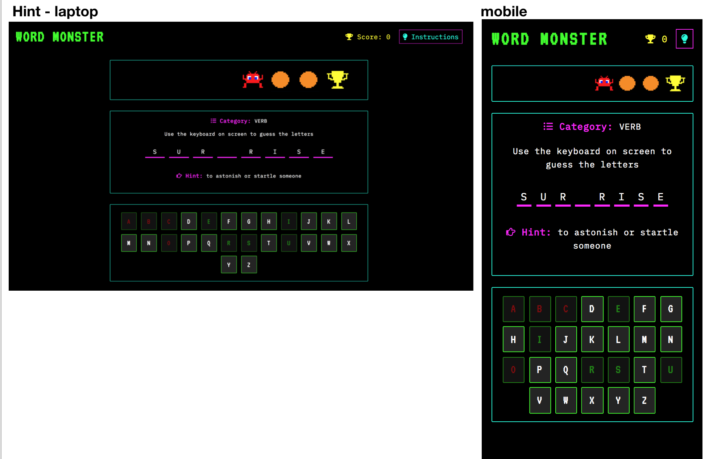
9. **Expectation:** *As a visiting user, I want to know what the word was, if I lose the game, so that I can learn the word or see how it is spelled*
>**Result:** Pass
- When the game is over, the word is revealed as shown below
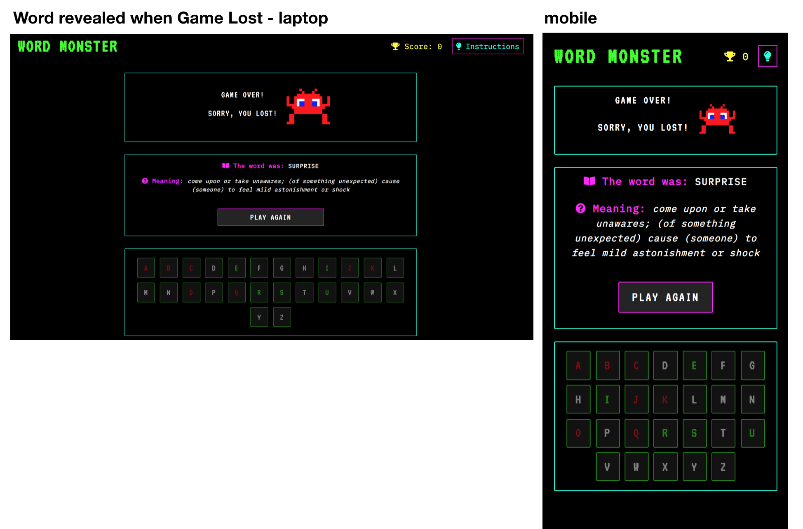
10. **Expectation:** *As a visiting user, I want to know the meaning of the word at the end of the game, regardless of whether I won or lost, so that I can add the word to my vocabulary*
>**Result:** Pass
- When the game is over, the word and its meaning are shown on screen, regardless of whether the game was won or lost.
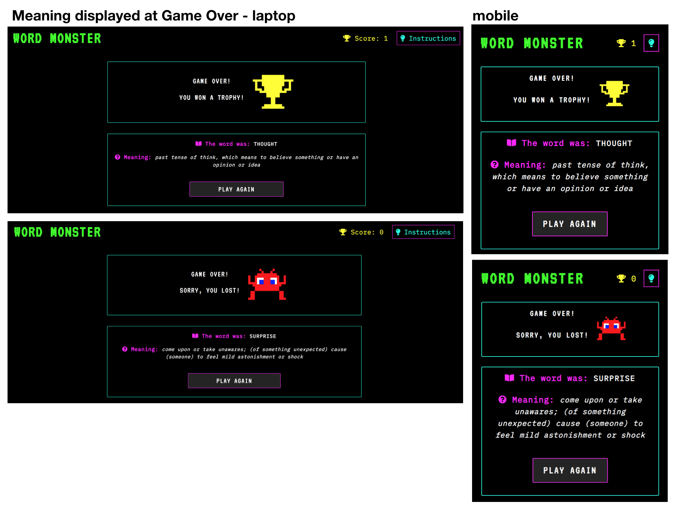
11. **Expectation:** *As a visiting user, I want to know how many games I have won during this session of playing*
>**Result:** Pass
- The user's score during this browsing session in this window is shown in the page header
- This remains constant across all pages
- On a new session or opening in a new window, the score resets to 0
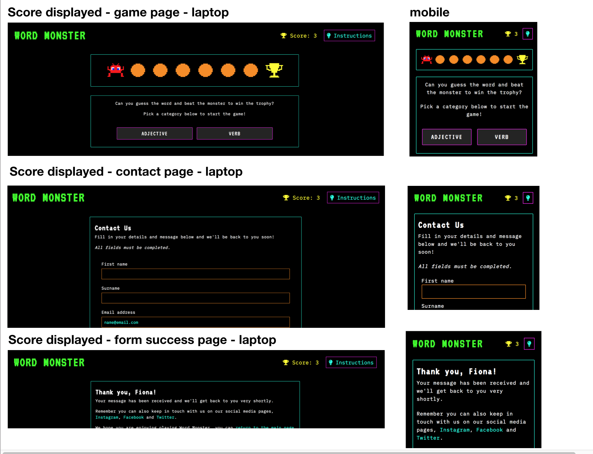
12. **Expectation:** *As a visiting user, I want to be able to contact the site owners if I come across any issues, have questions on the game or suggestions for improvement.*
>**Result:** Pass
- The footer on the home page contains a Contact Us link to the contact form
- This is also referenced in the Instructions
- On clicking the link the user is brought to the Contact Us page where they can complete the form
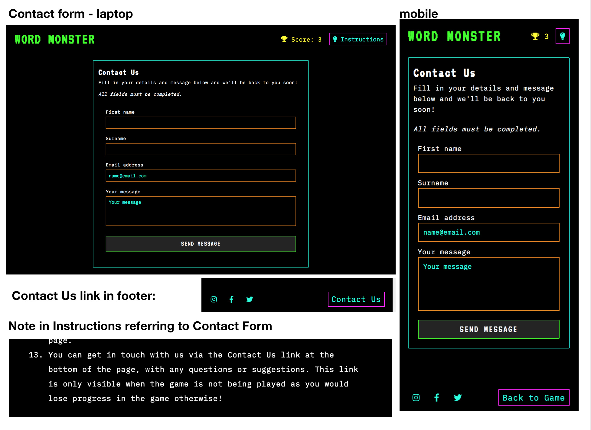
### Features Testing
- #### **Header: Expectations**
  - Top of the page, contains game name on the left, Score and Instructions on the right.
  - Fixed to the top of the page so that score is always visible
  - Instructions: when clicked displays the instructions on how to play the game, X in top right corner to close and return to game page
  - Score: displays a number indicating to the user how many games they have won during this session of playing. Display only, not clickable.
  - At smaller screen size, icons are shown for the Score (trophy) and Instructions (lightbulb) 
>**Result:** Pass
- All of the above are present, as shown below:
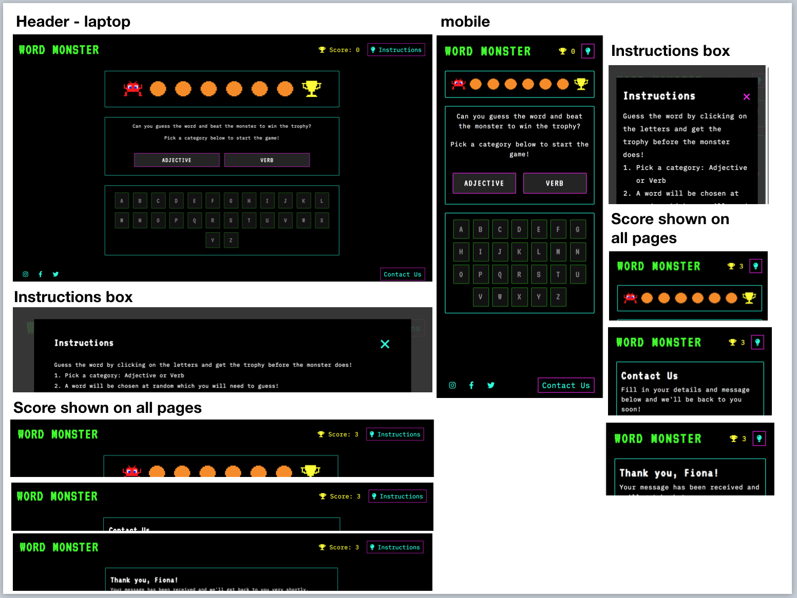
- #### **Game Area: Expectations**
  - Consists of three sections: Monster/guesses section; Word section; Keyboard section. 
  - The features of each vary depending on which stage the game is in: not-started, in-play, or over.
  - The full game area should always be visible on the screen for supported devices, without having to scroll down
>**Result:** Pass
- All of the above are present, as shown below
- The three sections are present and change accordingly, depending on the game stage
- the full game area is visible on screen for supported devices at all game stages
- The [file linked here shows the game area visible in full at the three game stages, on supported devices](docs/features-testing/game-area-supported-devices.pdf) while the below shows just the laptop screen for reference
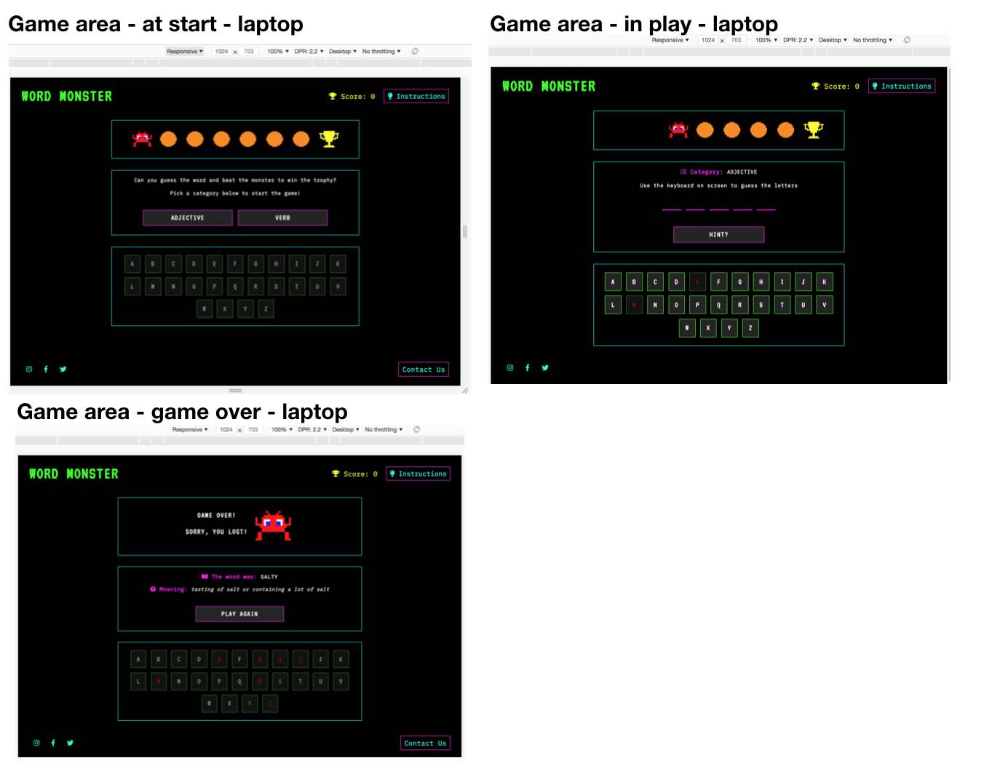
- #### **Game Area - Guesses section: Expectations**
  - At the 'not-started' stage of the game there is a 'monster' character and 6 obstacles between it and the trophy icon
  - For each wrong guess, one obstacle disappears and the monster moves into its place, thereby getting closer to the trophy
  - On the seventh wrong guess, the trophy disappears, meaning the game has been lost. The game is now in the 'over' state and a message is displayed: "Game Over. You Lost"
  - If the user guessed the letters correctly before the monster gets to the trophy, the game also enters the 'over' state and a message is displayed: "Game Over! You Won the Trophy!".
>**Result:** Pass
- All of the above are present, as shown below
- For each wrong guess, an obstacle disappears and the monster takes it place. 
- The relevant messages are shown at game over stage
- Seven wrong guesses means the game is lost
- Less than seven wrong guesses, and guessing the correct letters means the game is won
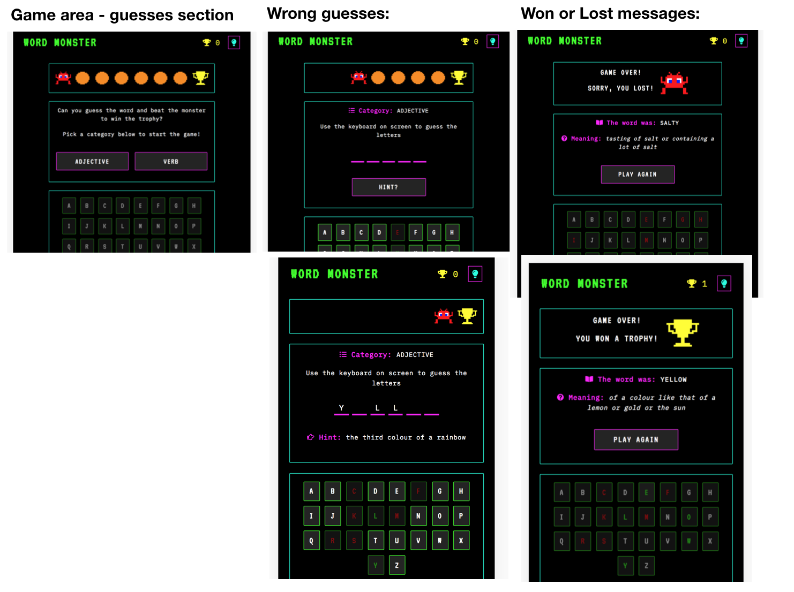
- #### **Game Area - Word section: Expectations**
  - contains a text box and a button area, these change depending on the stage of the game
  - At the 'not-started' stage, the text box instructs user to choose a category from the two buttons below it - Adjective or Verb. 
  - Once one of these buttons is pressed/clicked on, the game starts and is in the 'in-play' stage
  - The text box now displays the chosen word category, with a number of dashes underneath, representing the letters in the word to be guessed.
  - correctly guessed letters are shown in the relevant place in the word, above the dash
  - A Hint button is shown underneath the word to be guessed
  - When the Hint button is clicked, it displays a hint, which then remains displayed on the page until the game is over
  - When the game enters the 'over' stage, the text box shows a message confirming what the word was and its meaning.
  - The button is now a "Play Again" button
>**Result:** Pass
- All of the above are present, the content of the Word area changes as the game stages change, as shown below
- Before starting: text and category buttons
- In Play: Category, dashes for letters, Hint button
- Hint is displayed when Hint button clicked and remains on screen
- Game over: Word and Meaning is shown and Play again button 
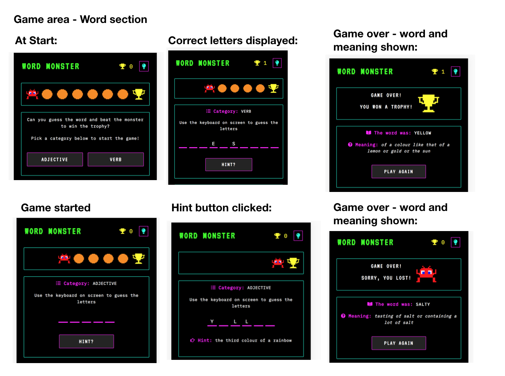
- #### **Game Area - Keyboard section: Expectations**
  - below the word to be guessed and contains a keyboard of letters from A to Z
  - Once a letter has been guessed it cannot be pressed/clicked on again, and it visually displays a different color to show it was already used
  - The keyboard letters are always displayed but are only active when the game is in the 'in-play' stage
>**Result:** Pass
- All of the above are present:
- keyboard is below Word section
- letters already guessed have reduced opacity, the letter is a different colour (green/red instead of white) and is disabled so can't be clicked again
- keyboard is disabled before Verb/Adjective button is clicked and at game-over stage. So only active while 'in-play' stage.
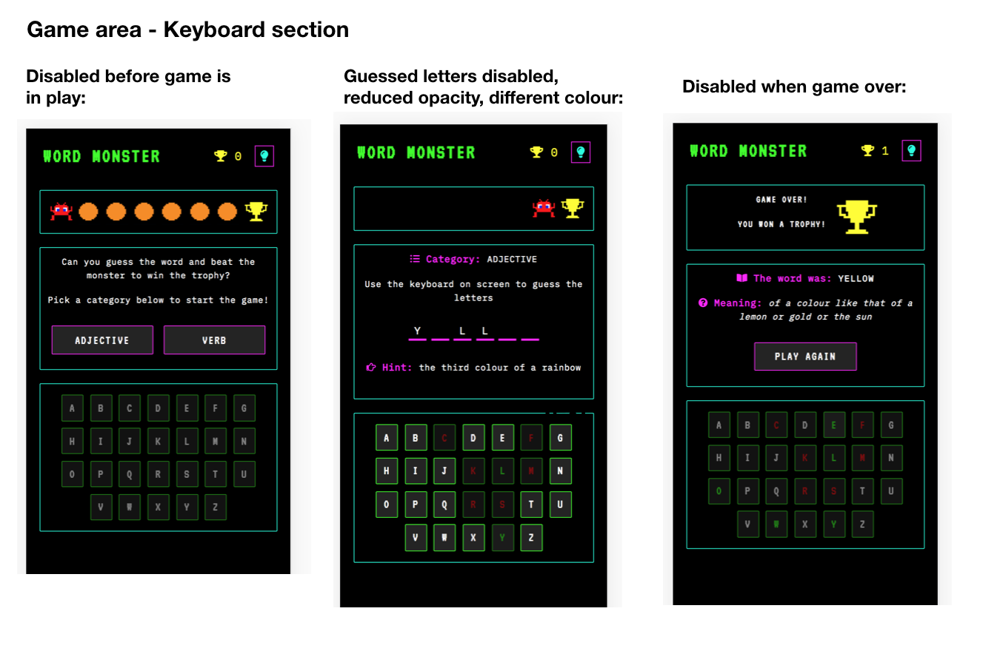
- #### **Game Area - Footer: Expectations**
  - contains the social media links: Facebook, Instagram and Twitter, represented by icons.
  - on the home page, this contains the Contact Us link to the Contact Form page. This link is not shown while the game is in the in-play stage.
  - on the Contact Form and Form Success page, footer contains Back to Game link in place of the Contact Us link
>**Result:** Pass
- All of the above are present:
- Social media icons always present
- Contact Us link present on home page, not present when game is in play
- Back to Game present on Contact and Form Success pages
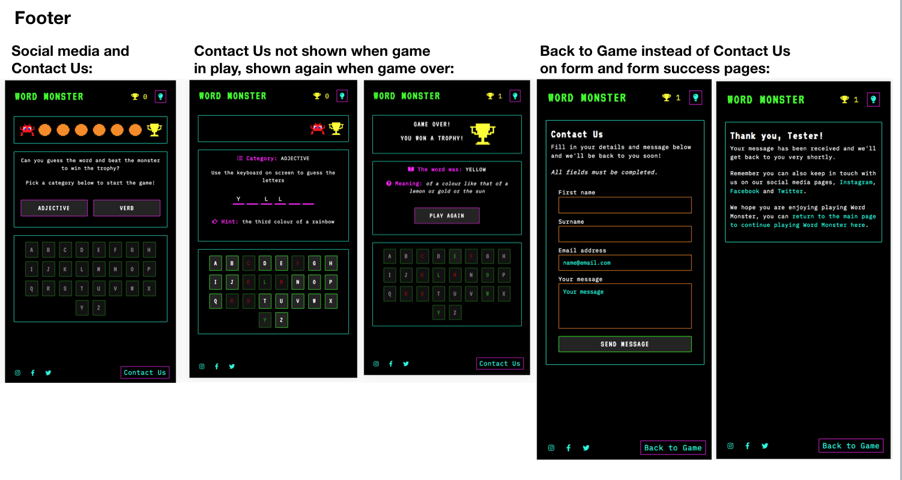
- #### **Game Area - Contact Form: Expectations**
  - contains the following inputs (all are mandatory) and validations:
    - First name: text
    - Surname: text
    - Email address: must be valid format for email address
    - Message: text
  - the border on inputs changes colour to indicate when a valid input is received
  - button called Send Message to submit the form
  - Success page is displayed after submitting, showing the first name that was input into the form First Name field
>**Result:** Pass
- All fields present on form
- All fields are mandatory, a message appears if I try to Send Message without all fields completed
- the border around the input/textarea changes to green when valid data is entered
- An error is shown if data is not valid e.g. no '@' in email field
- After submitting, a success message is shown, which includes the firstname that was entered onto the form

### Fixed Bugs
The following bugs were encountered during development and during testing.
-   **Issue: Keys can be pressed before game has started, i.e. before word is chosen:**
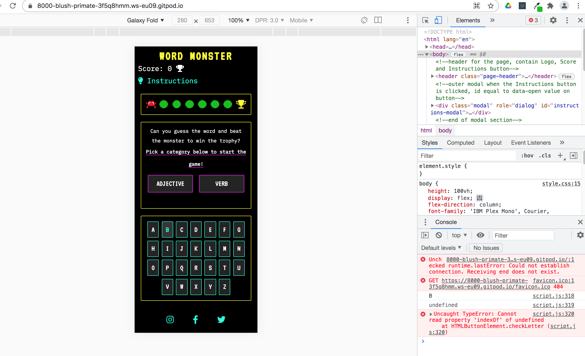
>Solution: Moved `eventListener` on the keys inside the `startGame function`, so only listening for click once the game is "in-play". And added `"disabled" attribute` to each key in the `HTML` so that they can't be clicked until game is "in-play", `startGame function` removes this `attribute` to allow clicks. `CSS` was also updated from a user perspective, to reduce the opacity of the keys when the game is not "in-play", so it is clear to the user that they cannot be clicked at this stage. 
-   **Issue: Correct guessed letters not displaying properly:**
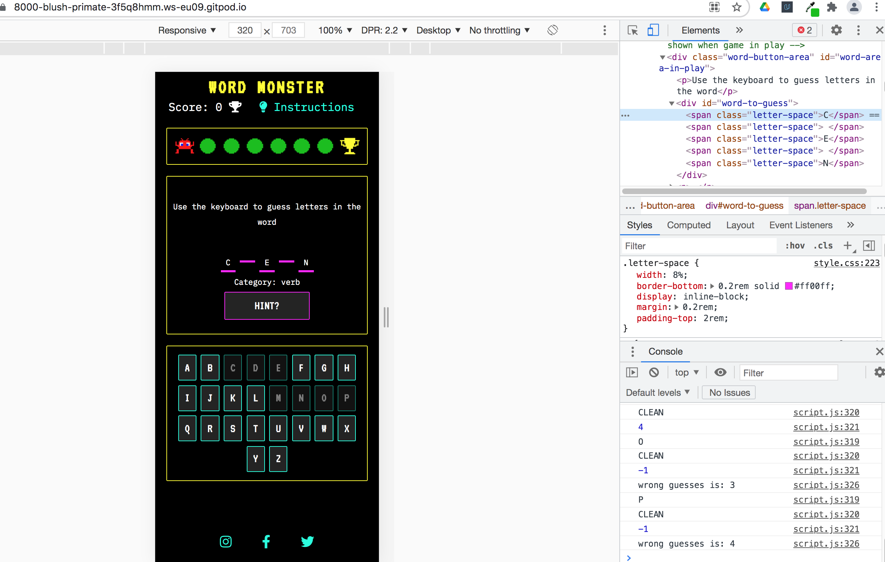
>Solution: Created a parent container `div` for the `spans` (which represent the letters to be guessed) to be inside. Set this as a flex container, `align-items: center` and added `height` to the `span` elements for some extra space. 
-   **Issue: Hint text still displayed on new game if hint button was clicked in previous game:**
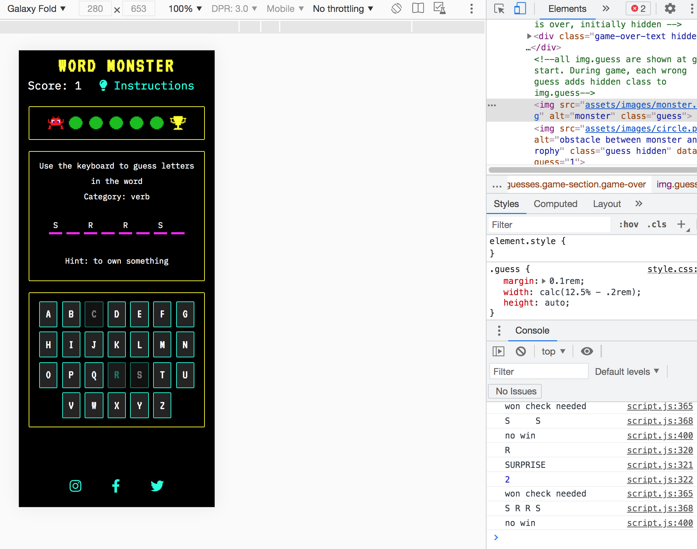
>Solution: Instead of just hiding the `"word-area-in-play" div` which contains the Hint button, the Hint button itself needs to be 'reset'. Updated the `resetGame function` to remove the `"hidden" class` from the Hint button, and to add the `"hidden" class` to the Hint text, i.e. put them back in the position they were before the game originally started. 
-   **Issue: Letter-spaces created in previous game appearing at start of new game:**
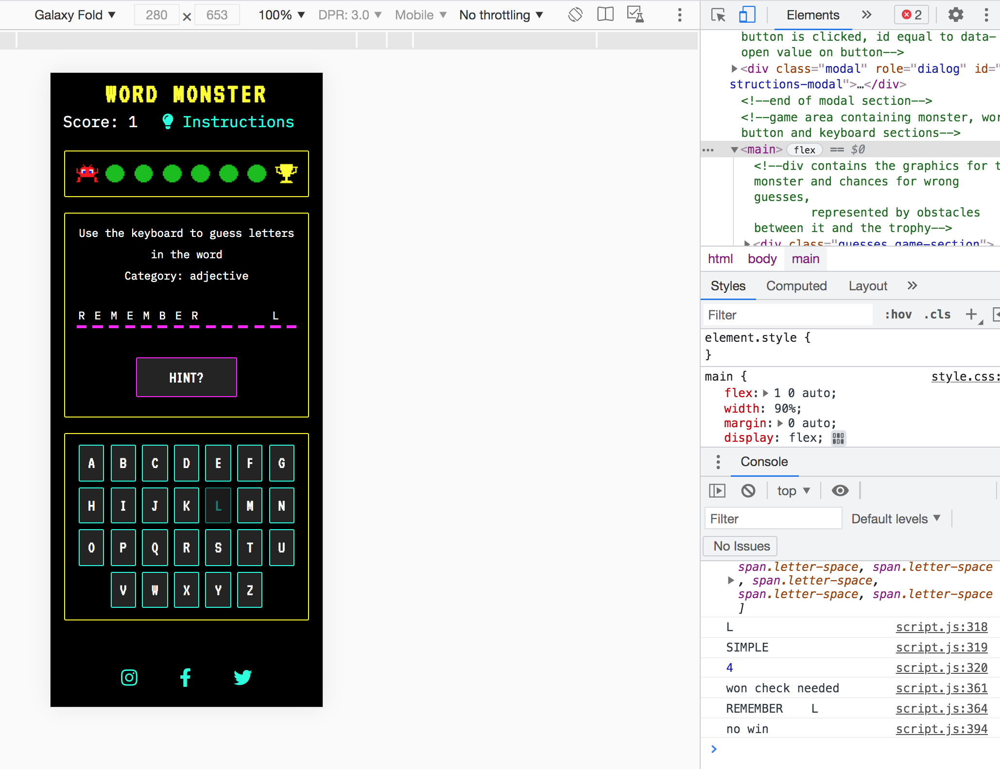
>Solution: The spans that were created during the game, based on number of letters in the word, need to be removed when resetting the game, they will be creating again on a new game based on the new word. Updated resetGame function with a `while loop` on the container `div`, to `removeChild` (`firstChild`) while the container `div` `hasChildNodes`.   
-   **Issue: Contact Form autocomplete information styles over-riding form styles:**
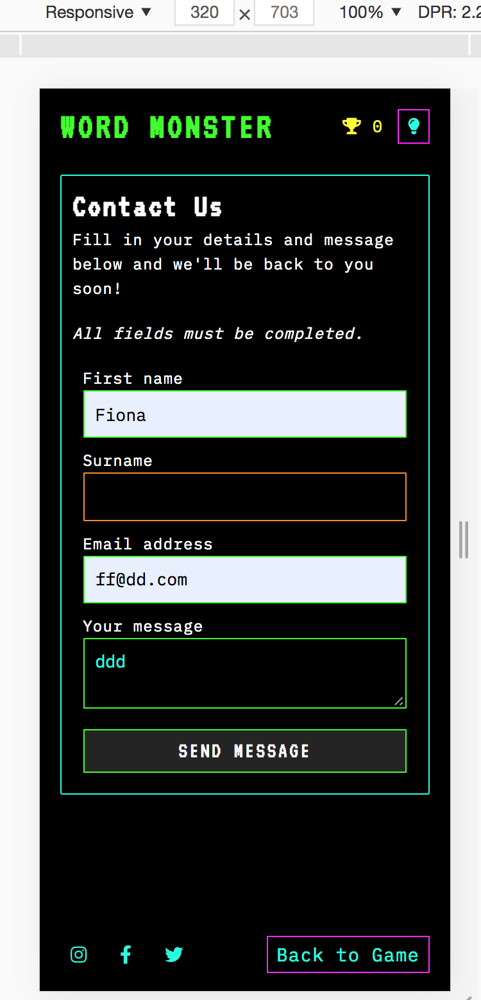
>Solution: Updated the CSS to over-ride the browser autocomplete font colour and background colour styles, based on [this post from CSS Tricks](https://css-tricks.com/snippets/css/change-autocomplete-styles-webkit-browsers/). 
-   **Issue: Name from Contact Form not appearing in Form Success message:**

>Solution: Used `sessionStorage` to store (`setItem`) the name value from the form in `contact.html`, and then `getItem` to display it in the `form-success.html` page (also used this method to store and get the Score in the header when the user changes between pages).   
- ### Other Testing (links etc.)
### Supported Screens and Browsers
The project was developed using Chrome as the baseline browser.  

The website and the game functionality has been tested on my personal mobile device Galaxy A40 and a 15 inch MacBook Pro.

Using the [Chrome Dev Tools](https://developer.chrome.com/docs/devtools/) simulator, the website has been tested on the following screen sizes (px) equating to the phone models listed. *Note these have been tested on the simulator only and not the actual devices*:
- Moto G4, Galaxy S5:  360 x 640
- Pixel 2: 411 x 731
- Pixel 2 XL: 411 x 823
- iPhone 5/SE: 320 x 568
- iPhone 6/7/8: 375 x 667
- iPhone 6/7/8 Plus: 414 x 736
- iPhone X: 375 x 812
- iPad: 768 x 1024
- iPad Pro: 1024 x 1366
- Surface Duo: 540 x 720
- Galaxy Fold 280 x 653

The website and the game functionality has been tested in Chrome as mentioned above, and also in Firefox and Safari. 

*Note:* there is a bug on Firefox as follows: when an incorrect letter is clicked, the colour of the letter does not update to red until the next letter is clicked. In the dev tools, I could see that the 'incorrect' class (which contains the change of colour to red) was being added to the pressed key as expected, however the color from the 'incorrect' class is not applied until the next click. The 'guesses' section functions correctly, so it is still clear to the user that the guess was incorrect. 

## Deployment
---
### Gitpod - during development
The site was developed on Gitpod, using GitHub for version control and hosting the repository and final site. The repository for this project, and the associated workspace, was created from the [Code Institute tempate](https://github.com/Code-Institute-Org/gitpod-full-template). 
-   During development, code was written in the Gitpod workspace and previewed by opening the browser via the Terminal in Gitpod, using the command `python3 -m http.server` and then selecting the Open Browser button when the following message appears: "a service is available on Port 8000". 
-   Files and code were added to the staging area in Gitpod using the command `git add .` and commited using `git commit -m "commit message"`. 
-   Commited changes were then pushed to GitHub using the `git push` command.
### GitHub Pages - Deployment
The following steps were followed to deploy the project to a live website in GitHub, using Github Pages:
1. Ensure changes have been added and commited in Gitpod and pushed to GitHub
2. Login to [GitHub](https://github.com/)
3. Locate the relevant repository on GitHub. [This is the repository for Word Monster](https://fiona-t.github.io/word-monster/).
4. At the top of the repository, above the green Gitpod button, locate the 'Settings' link and click on this
5. On the left of the page, under Options, scroll down until you get to Pages and click on Pages
6. Under Source, in the first box called None, click the dropdown and select either 'main' or 'master'. 
7. Then press Save
8. The page will refresh and you will see a link above the Save button. This is the link to the live site. Note that it may take a few minutes for the site to build, so be patient before clicking on the link to view the published site!

There are no differences between the deployed version and the development version of this project.
### Forking the GitHub Repository
The repository can be forked on GitHub, this creates a copy of the repository that can be viewed or amended without affecting the original repository. This can be done using the following steps:
1. Login to [GitHub](https://github.com/) and locate the repository as before
2. At the top right of the repository (under your avatar) locate the Fork button and click this button
3. You should now have a copy of the repository in your own GitHub account, to which you can make changes
### Cloning the GitHub Repository
You can make a clone of the repository which will create a local copy on your own computer. Again you can make changes to this local copy that will not affect the original repository. Follow these steps to clone the Walk Well repository. 
1. Login to [GitHub](https://github.com/) and locate the repository as before
2. Click the button called Code, located to the left of the green Gitpod button
3. Under HTTPS copy the link provided (in this case https://github.com/Fiona-T/word-monster.git) 
4. Go to Gitpod or whichever IDE you are using and open the Terminal
5. Change the current working directory to the location where you want the cloned directory to be made
6. Type `git clone` followed by the url you copied in step 3:
`git clone https://github.com/Fiona-T/word-monster.git`
7. Press Enter to create the local clone

You can refer to the [GitHub documentation](https://docs.github.com/en/github/creating-cloning-and-archiving-repositories/cloning-a-repository) for more detailed information on the above process.
## Credits
It should be noted again at this point that this project was created for educational purposes. Any non-original content is duly credited below.
### Code
Some of these refer to sources I consulted because my learning had not yet encompassed these points. Therefore I have referred to these sources to understand how to implement certain features/results and once I understood then I applied the understanding to the project and modified the code accordingly.
- To create the modal box for the Instructions, I followed the guidance on [this tutorial from W3Schools on modals](https://www.w3schools.com/howto/howto_css_modals.asp) to understand how to create the modal. I modified the code for this project.
- This [post on MDN Wed Docs]() explained how to `filter` an `array` based on a criteria. I modified the code accordingly and used this method in words.js, to `filter` the `words array` of `objects` by the word category (verb or adjective).
- I used the keyframes from [this CSS tutorial from W3Schools](https://www.w3schools.com/howto/howto_css_shake_image.asp) for the 'shake' animation on the trophy when a game is won. I used these keyframes exactly as is, with no modifications.
- I used the relevant code from [this post from CSS Tricks](https://css-tricks.com/snippets/css/change-autocomplete-styles-webkit-browsers/) to over-ride the form auto-complete browser styles

### Content
The Verb and Adjective words were sourced from the following websites (see more explanations on these word lists in the [Content Requirements](#content-requirements) section):
- [Sight Words, Dolch Words List](https://sightwords.com/sight-words/dolch/) 
- [Sight Words, Fry Words List](https://sightwords.com/sight-words/fry/#lists)   
- [SpellingCity - Adjectives List](https://www.spellingcity.com/adjectives.html)

The definitions for the words were sourced from the following online dictionary resources:
- [Cambridge Dictionary](https://dictionary.cambridge.org/)
- [Oxford Languages](https://languages.oup.com/google-dictionary-en/)
- [Learner's Dictionary](https://www.learnersdictionary.com/)
- [Vocabulary.com](https://www.vocabulary.com/dictionary/)
- [Dictionary.com](https://www.dictionary.com/)

The hints for each word were generated by the developer (and therefore some of them may be more helpful than others!).

### Media
The simple pixel graphics for the 'guesses' area:  the monster, obstacle and trophy; were created by the developer. As mentioned earlier, the style of these graphics along with the style of the website as a whole, is based on that of video/arcade games from the 1970s/1980s like [Pac-Man](https://en.wikipedia.org/wiki/Pac-Man) and [Space Invaders](https://en.wikipedia.org/wiki/Space_Invaders) and is therefore indebted to these from a stylistic point of view. 

## Acknowledgements
---
I would like to thank the following:
- my mentor Rohit Sharma for feedback and guidance throughout this project.
- the Code Institute Slack community for advice and support along the way
